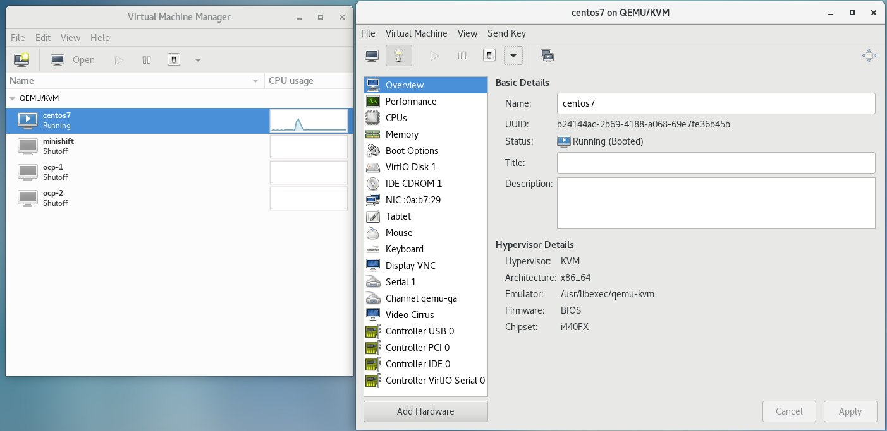
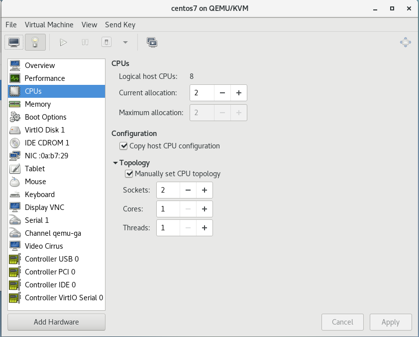

## Verify system virtualization support enabled
```
[fli@192-168-1-10 ~]$ egrep -q 'vmx|svm' /proc/cpuinfo && echo yes || echo no
yes
[fli@192-168-1-10 ~]$ 
```

## Enable nested virtualization in KVM

To run a hypervisor inside a KVM virtual machine, KVM uses QEMU for Nested Virtual guest.

* Check the current nested virtual setting in linux 'kvm_intel' kernel module
```
[fli@192-168-1-10 ~]$ cat /sys/module/kvm_intel/parameters/nested
N
[fli@192-168-1-10 ~]$ 
```

* Enable nested virtual
```
[fli@192-168-1-10 ~]$ lsmod | grep kvm
kvm_intel             183621  0 
kvm                   586948  1 kvm_intel
irqbypass              13503  1 kvm
[fli@192-168-1-10 ~]$ sudo modprobe -r kvm_intel
[fli@192-168-1-10 ~]$ lsmod | grep kvm
[fli@192-168-1-10 ~]$ 
[fli@192-168-1-10 ~]$ sudo modprobe kvm_intel nested=1
[fli@192-168-1-10 ~]$ lsmod | grep kvm
kvm_intel             183621  0 
kvm                   586948  1 kvm_intel
irqbypass              13503  1 kvm
[fli@192-168-1-10 ~]$ 
```

* Check the new nested virtual setting in linux 'kvm_intel' kernel module
```
[fli@192-168-1-10 ~]$ cat /sys/module/kvm_intel/parameters/nested
Y
[fli@192-168-1-10 ~]$ 
```

* Enable the nested feature permanently
```
[fli@192-168-1-10 ~]$ su -
Password: 
Last login: Sat Nov 16 21:02:03 AEDT 2019 on pts/1
[root@192-168-1-10 ~]# vim /etc/modprobe.d/kvm_intel.conf
[root@192-168-1-10 ~]# cat /etc/modprobe.d/kvm_intel.conf
options kvm_intel nested=1
[root@192-168-1-10 ~]# exit
logout
[fli@192-168-1-10 ~]$ 
```

* Start a KVM virtual machine
```
[fli@192-168-1-10 ~]$ sudo virsh list --all
[sudo] password for fli: 
 Id    Name                           State
----------------------------------------------------
 -     centos7                        shut off
[fli@192-168-1-10 ~]$ sudo virsh start centos7
Domain centos7 started

[fli@192-168-1-10 ~]$ sudo virsh list --all
 Id    Name                           State
----------------------------------------------------
 1     centos7                        running
[fli@192-168-1-10 ~]$ 
```

* ssh to it and see this VM doesnt support virtualization
```
[fli@192-168-1-10 ~]$ ssh fli@192.168.122.11
fli@192.168.122.11's password: 
Last login: Thu Dec  5 15:57:11 2019
[fli@localhost ~]$ cat /proc/cpuinfo | grep  -i -E "vmx|svm"
[fli@localhost ~]$ exit
logout
Connection to 192.168.122.11 closed.
[fli@192-168-1-10 ~]$ 
```

* [Configure nested virtualization in virt-manager for KVM VMs](https://docs.fedoraproject.org/en-US/quick-docs/using-nested-virtualization-in-kvm/)




* Power circle this VM now, double check the VM cpu again and see it is ready for virtualization
```
[fli@192-168-1-10 ~]$ ssh fli@192.168.122.11
fli@192.168.122.11's password: 
Last login: Thu Dec  5 16:29:30 2019
[fli@192-168-1-10 ~]$ egrep -q 'vmx|svm' /proc/cpuinfo && echo yes || echo no
yes
[fli@192-168-1-10 ~]$ 

[fli@localhost ~]$ exit
logout
Connection to 192.168.122.11 closed.
[fli@192-168-1-10 ~]$ 
```

##  Validate that libvirt reports no errors
```
[fli@192-168-1-10 ~]$ virt-host-validate
  QEMU: Checking for hardware virtualization                                 : PASS
  QEMU: Checking if device /dev/kvm exists                                   : PASS
  QEMU: Checking if device /dev/kvm is accessible                            : PASS
  QEMU: Checking if device /dev/vhost-net exists                             : PASS
  QEMU: Checking if device /dev/net/tun exists                               : PASS
  QEMU: Checking for cgroup 'memory' controller support                      : PASS
  QEMU: Checking for cgroup 'memory' controller mount-point                  : PASS
  QEMU: Checking for cgroup 'cpu' controller support                         : PASS
  QEMU: Checking for cgroup 'cpu' controller mount-point                     : PASS
  QEMU: Checking for cgroup 'cpuacct' controller support                     : PASS
  QEMU: Checking for cgroup 'cpuacct' controller mount-point                 : PASS
  QEMU: Checking for cgroup 'cpuset' controller support                      : PASS
  QEMU: Checking for cgroup 'cpuset' controller mount-point                  : PASS
  QEMU: Checking for cgroup 'devices' controller support                     : PASS
  QEMU: Checking for cgroup 'devices' controller mount-point                 : PASS
  QEMU: Checking for cgroup 'blkio' controller support                       : PASS
  QEMU: Checking for cgroup 'blkio' controller mount-point                   : PASS
  QEMU: Checking for device assignment IOMMU support                         : WARN (No ACPI DMAR table found, IOMMU either disabled in BIOS or not supported by this hardware platform)
   LXC: Checking for Linux >= 2.6.26                                         : PASS
   LXC: Checking for namespace ipc                                           : PASS
   LXC: Checking for namespace mnt                                           : PASS
   LXC: Checking for namespace pid                                           : PASS
   LXC: Checking for namespace uts                                           : PASS
   LXC: Checking for namespace net                                           : PASS
   LXC: Checking for namespace user                                          : PASS
   LXC: Checking for cgroup 'memory' controller support                      : PASS
   LXC: Checking for cgroup 'memory' controller mount-point                  : PASS
   LXC: Checking for cgroup 'cpu' controller support                         : PASS
   LXC: Checking for cgroup 'cpu' controller mount-point                     : PASS
   LXC: Checking for cgroup 'cpuacct' controller support                     : PASS
   LXC: Checking for cgroup 'cpuacct' controller mount-point                 : PASS
   LXC: Checking for cgroup 'cpuset' controller support                      : PASS
   LXC: Checking for cgroup 'cpuset' controller mount-point                  : PASS
   LXC: Checking for cgroup 'devices' controller support                     : PASS
   LXC: Checking for cgroup 'devices' controller mount-point                 : PASS
   LXC: Checking for cgroup 'blkio' controller support                       : PASS
   LXC: Checking for cgroup 'blkio' controller mount-point                   : PASS
   LXC: Checking if device /sys/fs/fuse/connections exists                   : PASS
[fli@192-168-1-10 ~]$ 
```

## [download and setup minikube](https://minikube.sigs.k8s.io/docs/start/linux/)

```
curl -Lo minikube https://storage.googleapis.com/minikube/releases/v0.23.0/minikube-darwin-amd64 && chmod +x minikube && sudo mv minikube /usr/local/bin/

[fli@192-168-1-10 ~]$ curl -LO https://storage.googleapis.com/minikube/releases/latest/minikube-1.5.2.rpm && sudo rpm -ivh minikube-1.5.2.rpm
  % Total    % Received % Xferd  Average Speed   Time    Time     Time  Current
                                 Dload  Upload   Total   Spent    Left  Speed
100 12.2M  100 12.2M    0     0  1121k      0  0:00:11  0:00:11 --:--:-- 1391k
[sudo] password for fli: 
Preparing...                          ################################# [100%]
Updating / installing...
   1:minikube-1.5.2-0                 ################################# [100%]
[fli@192-168-1-10 ~]$ 
```

## Update minikube config
```
[fli@192-168-1-10 ~]$ minikube config set vm-driver kvm2
⚠️  These changes will take effect upon a minikube delete and then a minikube start
[fli@192-168-1-10 ~]$ minikube config get vm-driver
kvm2
[fli@192-168-1-10 ~]$ 

[fli@192-168-1-10 ~]$ minikube config set memory 4096
⚠️  These changes will take effect upon a minikube delete and then a minikube start
[fli@192-168-1-10 ~]$ minikube config get memory
4096
[fli@192-168-1-10 ~]$ 
```

## [Install kubectl](https://kubernetes.io/docs/tasks/tools/install-kubectl/)
```
[fli@192-168-1-10 ~]$ curl -LO https://storage.googleapis.com/kubernetes-release/release/`curl -s https://storage.googleapis.com/kubernetes-release/release/stable.txt`/bin/linux/amd64/kubectl && chmod +x kubectl && sudo mv kubectl /usr/local/bin/
  % Total    % Received % Xferd  Average Speed   Time    Time     Time  Current
                                 Dload  Upload   Total   Spent    Left  Speed
100 44.5M  100 44.5M    0     0  1358k      0  0:00:33  0:00:33 --:--:-- 1399k
[sudo] password for fli: 
[fli@192-168-1-10 ~]$ 

[fli@192-168-1-10 ~]$ kubectl version
Client Version: version.Info{Major:"1", Minor:"16", GitVersion:"v1.16.3", GitCommit:"b3cbbae08ec52a7fc73d334838e18d17e8512749", GitTreeState:"clean", BuildDate:"2019-11-13T11:23:11Z", GoVersion:"go1.12.12", Compiler:"gc", Platform:"linux/amd64"}
Server Version: version.Info{Major:"1", Minor:"16", GitVersion:"v1.16.2", GitCommit:"c97fe5036ef3df2967d086711e6c0c405941e14b", GitTreeState:"clean", BuildDate:"2019-10-15T19:09:08Z", GoVersion:"go1.12.10", Compiler:"gc", Platform:"linux/amd64"}
[fli@192-168-1-10 ~]$ 

[fli@192-168-1-10 ~]$ minikube start
😄  minikube v1.5.2 on Centos 7.6.1810
🔥  Creating kvm2 VM (CPUs=2, Memory=4096MB, Disk=20000MB) ...
🐳  Preparing Kubernetes v1.16.2 on Docker '18.09.9' ...
🚜  Pulling images ...
🚀  Launching Kubernetes ... 
⌛  Waiting for: apiserver
🏄  Done! kubectl is now configured to use "minikube"
[fli@192-168-1-10 ~]$ 

[fli@192-168-1-10 ~]$ minikube status
host: Running
kubelet: Running
apiserver: Running
kubeconfig: Configured
[fli@192-168-1-10 ~]$ 

[fli@192-168-1-10 ~]$ kubectl cluster-info
Kubernetes master is running at https://192.168.39.239:8443
KubeDNS is running at https://192.168.39.239:8443/api/v1/namespaces/kube-system/services/kube-dns:dns/proxy

To further debug and diagnose cluster problems, use 'kubectl cluster-info dump'.
[fli@192-168-1-10 ~]$ 
```

