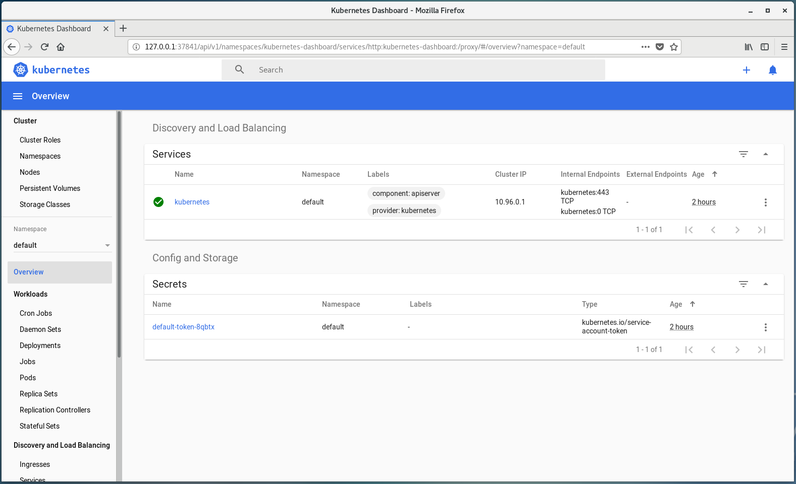

## minikube commands

minikube ip   
minikube dashboard &   

minikube stop    
minikube start    
minikube status    
minikube delete    

```
[fli@192-168-1-10 ~]$ minikube ip
192.168.39.239
[fli@192-168-1-10 ~]$
```

* The dashboard

minikube dashboard    
minikube dashboard &    
minikube dashboard --url=true    

```
[fli@192-168-1-10 ~]$ minikube dashboard &
[1] 18849
[fli@192-168-1-10 ~]$ 🤔  Verifying dashboard health ...
🚀  Launching proxy ...
🤔  Verifying proxy health ...
🎉  Opening http://127.0.0.1:37841/api/v1/namespaces/kubernetes-dashboard/services/http:kubernetes-dashboard:/proxy/ in your default browser...
This tool has been deprecated, use 'gio open' instead.
See 'gio help open' for more info.
```


* minikube addons
```
[fli@192-168-1-10 ~]$ minikube addons list
- addon-manager: enabled
- dashboard: enabled
- default-storageclass: enabled
- efk: disabled
- freshpod: disabled
- gvisor: disabled
- heapster: disabled
- helm-tiller: disabled
- ingress: disabled
- ingress-dns: disabled
- logviewer: disabled
- metrics-server: disabled
- nvidia-driver-installer: disabled
- nvidia-gpu-device-plugin: disabled
- registry: disabled
- registry-creds: disabled
- storage-provisioner: enabled
- storage-provisioner-gluster: disabled
[fli@192-168-1-10 ~]$ 
```

* Stop minikube
```
[fli@192-168-1-10 ~]$ minikube stop
✋  Stopping "minikube" in kvm2 ...
🛑  "minikube" stopped.
[fli@192-168-1-10 ~]$ 

```

## kubectl commands

* Get k8s cluster information

```
[fli@192-168-1-10 ~]$ kubectl cluster-info
Kubernetes master is running at https://192.168.39.239:8443
KubeDNS is running at https://192.168.39.239:8443/api/v1/namespaces/kube-system/services/kube-dns:dns/proxy

To further debug and diagnose cluster problems, use 'kubectl cluster-info dump'.
[fli@192-168-1-10 ~]$ 

kubectl cluster-info dump                                           // dump the k8s cluster information

```

* Access k8s API server via proxy

```
[fli@192-168-1-10 ~]$ kubectl proxy &                               // start k8s proxy in background
[1] 20149
[fli@192-168-1-10 ~]$ Starting to serve on 127.0.0.1:8001

[fli@192-168-1-10 ~]$ 

[fli@192-168-1-10 ~]$ curl http://localhost:8001                    // access k8s API server
{
  "paths": [
    "/api",
    "/api/v1",
    "/apis",
    "/apis/",
    "/apis/admissionregistration.k8s.io",
    "/apis/admissionregistration.k8s.io/v1",
    "/apis/admissionregistration.k8s.io/v1beta1",
    "/apis/apiextensions.k8s.io",
    "/apis/apiextensions.k8s.io/v1",
    "/apis/apiextensions.k8s.io/v1beta1",
    "/apis/apiregistration.k8s.io",
    "/apis/apiregistration.k8s.io/v1",
    "/apis/apiregistration.k8s.io/v1beta1",
    "/apis/apps",
    "/apis/apps/v1",
    "/apis/authentication.k8s.io",
    "/apis/authentication.k8s.io/v1",
    "/apis/authentication.k8s.io/v1beta1",
    "/apis/authorization.k8s.io",
    "/apis/authorization.k8s.io/v1",
    "/apis/authorization.k8s.io/v1beta1",
    "/apis/autoscaling",
    "/apis/autoscaling/v1",
    "/apis/autoscaling/v2beta1",
    "/apis/autoscaling/v2beta2",
    "/apis/batch",
    "/apis/batch/v1",
    "/apis/batch/v1beta1",
    "/apis/certificates.k8s.io",
    "/apis/certificates.k8s.io/v1beta1",
    "/apis/coordination.k8s.io",
    "/apis/coordination.k8s.io/v1",
    "/apis/coordination.k8s.io/v1beta1",
    "/apis/events.k8s.io",
    "/apis/events.k8s.io/v1beta1",
    "/apis/extensions",
    "/apis/extensions/v1beta1",
    "/apis/networking.k8s.io",
    "/apis/networking.k8s.io/v1",
    "/apis/networking.k8s.io/v1beta1",
    "/apis/node.k8s.io",
    "/apis/node.k8s.io/v1beta1",
    "/apis/policy",
    "/apis/policy/v1beta1",
    "/apis/rbac.authorization.k8s.io",
    "/apis/rbac.authorization.k8s.io/v1",
    "/apis/rbac.authorization.k8s.io/v1beta1",
    "/apis/scheduling.k8s.io",
    "/apis/scheduling.k8s.io/v1",
    "/apis/scheduling.k8s.io/v1beta1",
    "/apis/storage.k8s.io",
    "/apis/storage.k8s.io/v1",
    "/apis/storage.k8s.io/v1beta1",
    "/healthz",
    "/healthz/autoregister-completion",
    "/healthz/etcd",
    "/healthz/log",
    "/healthz/ping",
    "/healthz/poststarthook/apiservice-openapi-controller",
    "/healthz/poststarthook/apiservice-registration-controller",
    "/healthz/poststarthook/apiservice-status-available-controller",
    "/healthz/poststarthook/bootstrap-controller",
    "/healthz/poststarthook/ca-registration",
    "/healthz/poststarthook/crd-informer-synced",
    "/healthz/poststarthook/generic-apiserver-start-informers",
    "/healthz/poststarthook/kube-apiserver-autoregistration",
    "/healthz/poststarthook/rbac/bootstrap-roles",
    "/healthz/poststarthook/scheduling/bootstrap-system-priority-classes",
    "/healthz/poststarthook/start-apiextensions-controllers",
    "/healthz/poststarthook/start-apiextensions-informers",
    "/healthz/poststarthook/start-kube-aggregator-informers",
    "/healthz/poststarthook/start-kube-apiserver-admission-initializer",
    "/livez",
    "/livez/autoregister-completion",
    "/livez/etcd",
    "/livez/log",
    "/livez/ping",
    "/livez/poststarthook/apiservice-openapi-controller",
    "/livez/poststarthook/apiservice-registration-controller",
    "/livez/poststarthook/apiservice-status-available-controller",
    "/livez/poststarthook/bootstrap-controller",
    "/livez/poststarthook/ca-registration",
    "/livez/poststarthook/crd-informer-synced",
    "/livez/poststarthook/generic-apiserver-start-informers",
    "/livez/poststarthook/kube-apiserver-autoregistration",
    "/livez/poststarthook/rbac/bootstrap-roles",
    "/livez/poststarthook/scheduling/bootstrap-system-priority-classes",
    "/livez/poststarthook/start-apiextensions-controllers",
    "/livez/poststarthook/start-apiextensions-informers",
    "/livez/poststarthook/start-kube-aggregator-informers",
    "/livez/poststarthook/start-kube-apiserver-admission-initializer",
    "/logs",
    "/metrics",
    "/openapi/v2",
    "/readyz",
    "/readyz/autoregister-completion",
    "/readyz/etcd",
    "/readyz/log",
    "/readyz/ping",
    "/readyz/poststarthook/apiservice-openapi-controller",
    "/readyz/poststarthook/apiservice-registration-controller",
    "/readyz/poststarthook/apiservice-status-available-controller",
    "/readyz/poststarthook/bootstrap-controller",
    "/readyz/poststarthook/ca-registration",
    "/readyz/poststarthook/crd-informer-synced",
    "/readyz/poststarthook/generic-apiserver-start-informers",
    "/readyz/poststarthook/kube-apiserver-autoregistration",
    "/readyz/poststarthook/rbac/bootstrap-roles",
    "/readyz/poststarthook/scheduling/bootstrap-system-priority-classes",
    "/readyz/poststarthook/start-apiextensions-controllers",
    "/readyz/poststarthook/start-apiextensions-informers",
    "/readyz/poststarthook/start-kube-aggregator-informers",
    "/readyz/poststarthook/start-kube-apiserver-admission-initializer",
    "/readyz/shutdown",
    "/version"
  ]
}[fli@192-168-1-10 ~]$ 
```

* Get k8s nodes and its information
```
[fli@192-168-1-10 ~]$ kubectl get nodes
NAME       STATUS   ROLES    AGE    VERSION
minikube   Ready    master   177m   v1.16.2
[fli@192-168-1-10 ~]$ 

[fli@192-168-1-10 ~]$ kubectl describe node minikube
Name:               minikube
Roles:              master
Labels:             beta.kubernetes.io/arch=amd64
                    beta.kubernetes.io/os=linux
                    kubernetes.io/arch=amd64
                    kubernetes.io/hostname=minikube
                    kubernetes.io/os=linux
                    node-role.kubernetes.io/master=
Annotations:        kubeadm.alpha.kubernetes.io/cri-socket: /var/run/dockershim.sock
                    node.alpha.kubernetes.io/ttl: 0
                    volumes.kubernetes.io/controller-managed-attach-detach: true
CreationTimestamp:  Thu, 05 Dec 2019 17:11:28 +1100
Taints:             <none>
Unschedulable:      false
Conditions:
  Type             Status  LastHeartbeatTime                 LastTransitionTime                Reason                       Message
  ----             ------  -----------------                 ------------------                ------                       -------
  MemoryPressure   False   Fri, 06 Dec 2019 10:12:59 +1100   Thu, 05 Dec 2019 17:11:24 +1100   KubeletHasSufficientMemory   kubelet has sufficient memory available
  DiskPressure     False   Fri, 06 Dec 2019 10:12:59 +1100   Thu, 05 Dec 2019 17:11:24 +1100   KubeletHasNoDiskPressure     kubelet has no disk pressure
  PIDPressure      False   Fri, 06 Dec 2019 10:12:59 +1100   Thu, 05 Dec 2019 17:11:24 +1100   KubeletHasSufficientPID      kubelet has sufficient PID available
  Ready            True    Fri, 06 Dec 2019 10:12:59 +1100   Thu, 05 Dec 2019 17:11:24 +1100   KubeletReady                 kubelet is posting ready status
Addresses:
  InternalIP:  192.168.39.239
  Hostname:    minikube
Capacity:
 cpu:                2
 ephemeral-storage:  16954240Ki
 hugepages-2Mi:      0
 memory:             3843760Ki
 pods:               110
Allocatable:
 cpu:                2
 ephemeral-storage:  16954240Ki
 hugepages-2Mi:      0
 memory:             3843760Ki
 pods:               110
System Info:
 Machine ID:                 572d50239b7b4138aeba314d8bf348f3
 System UUID:                572d5023-9b7b-4138-aeba-314d8bf348f3
 Boot ID:                    dfa673f5-fc1b-4985-a863-6cfa39dd52f5
 Kernel Version:             4.19.76
 OS Image:                   Buildroot 2019.02.6
 Operating System:           linux
 Architecture:               amd64
 Container Runtime Version:  docker://18.9.9
 Kubelet Version:            v1.16.2
 Kube-Proxy Version:         v1.16.2
Non-terminated Pods:         (11 in total)
  Namespace                  Name                                          CPU Requests  CPU Limits  Memory Requests  Memory Limits  AGE
  ---------                  ----                                          ------------  ----------  ---------------  -------------  ---
  kube-system                coredns-5644d7b6d9-c7qrx                      100m (5%)     0 (0%)      70Mi (1%)        170Mi (4%)     17h
  kube-system                coredns-5644d7b6d9-jjs4h                      100m (5%)     0 (0%)      70Mi (1%)        170Mi (4%)     17h
  kube-system                etcd-minikube                                 0 (0%)        0 (0%)      0 (0%)           0 (0%)         17h
  kube-system                kube-addon-manager-minikube                   5m (0%)       0 (0%)      50Mi (1%)        0 (0%)         17h
  kube-system                kube-apiserver-minikube                       250m (12%)    0 (0%)      0 (0%)           0 (0%)         17h
  kube-system                kube-controller-manager-minikube              200m (10%)    0 (0%)      0 (0%)           0 (0%)         17h
  kube-system                kube-proxy-tdbpb                              0 (0%)        0 (0%)      0 (0%)           0 (0%)         17h
  kube-system                kube-scheduler-minikube                       100m (5%)     0 (0%)      0 (0%)           0 (0%)         17h
  kube-system                storage-provisioner                           0 (0%)        0 (0%)      0 (0%)           0 (0%)         17h
  kubernetes-dashboard       dashboard-metrics-scraper-76585494d8-7qqnf    0 (0%)        0 (0%)      0 (0%)           0 (0%)         14h
  kubernetes-dashboard       kubernetes-dashboard-57f4cb4545-g9mtt         0 (0%)        0 (0%)      0 (0%)           0 (0%)         14h
Allocated resources:
  (Total limits may be over 100 percent, i.e., overcommitted.)
  Resource           Requests    Limits
  --------           --------    ------
  cpu                755m (37%)  0 (0%)
  memory             190Mi (5%)  340Mi (9%)
  ephemeral-storage  0 (0%)      0 (0%)
Events:
  Type    Reason                   Age                    From                  Message
  ----    ------                   ----                   ----                  -------
  Normal  Starting                 7m54s                  kubelet, minikube     Starting kubelet.
  Normal  NodeAllocatableEnforced  7m54s                  kubelet, minikube     Updated Node Allocatable limit across pods
  Normal  NodeHasNoDiskPressure    7m53s (x7 over 7m54s)  kubelet, minikube     Node minikube status is now: NodeHasNoDiskPressure
  Normal  NodeHasSufficientMemory  7m52s (x8 over 7m54s)  kubelet, minikube     Node minikube status is now: NodeHasSufficientMemory
  Normal  NodeHasSufficientPID     7m52s (x8 over 7m54s)  kubelet, minikube     Node minikube status is now: NodeHasSufficientPID
  Normal  Starting                 6m54s                  kube-proxy, minikube  Starting kube-proxy.
[fli@192-168-1-10 ~]$ 

```
